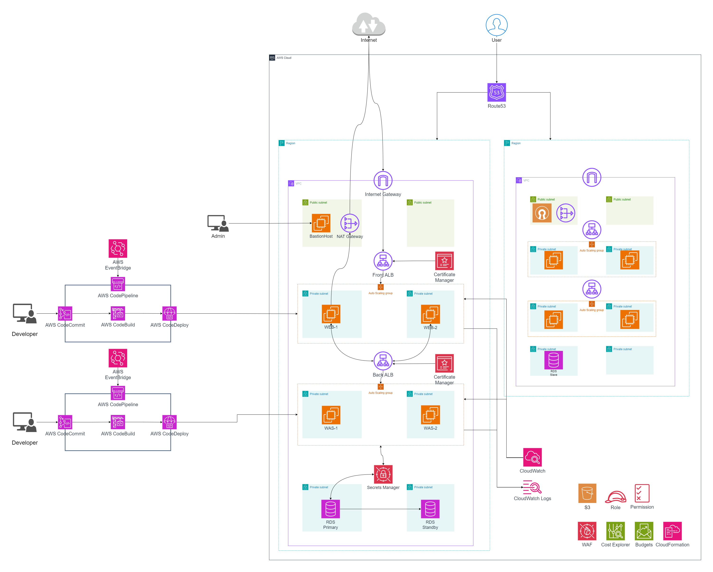

# Working SCV Project

### Architecture


- [ ] 서울리전
  - [ ] 배포와 테스트를 위한 인프라 구축 가능성.
  - [ ] ❓ On-promise에 구축할지?
  - [ ] 배포 정책과 방식에 따라 달라 질 수 있을 것
- [ ] 일본리전

### 실행
- .tfvars 파일 만들어 참조해야 함.
```
# {{ YOUR_ENV_FILE_NAME }}.tfvars
region = YOUR_REGION
domain = YOUR_DOMAIN_NAME
isPrimary = true || false
```
```sh
terraform init
terraform validate
terraform plan

terraform apply -var-file={{ YOUR_ENV_FILE_NAME }}.tfvars -auto-approve

# terraform apply -var-file=test.tfvars -auto-approve

terraform destroy -var-file={{ YOUR_ENV_FILE_NAME }}.tfvars -auto-approve

# terraform destroy -var-file=test.tfvars -auto-approve
```

### ✅ 1. Infra
---
- [x] Infra


  - [x] vpc 생성 


  - [x] Internet Gateway 생성


  - [x] 퍼블릭 서브넷 생성
    - [x] 라우팅 테이블 생성


  - [x] webserver-was 프라이빗 서브넷 생성
    - [x] 라우팅 테이블 생성


  - [x] db 프라이빗 서브넷 생성
    - [x] 라우팅 테이블 생성


  - [x] NAT Gateway 생성
    - [x] EIP 생성
    - [x] NAT Gateway가 있어야 외부에 트래픽을 보낼 수 있고,
    - [x] 이 말은 외부의 서비스를 이용하던지,
    - [x] 외부로 서비스를 하던지,
    - [x] 반드시 필요함.

### 2. Servers
---
- [ ] Servers


  - [ ] OpenVPN
    - [x] 보안 그룹
    - [x] 구독관련된 내용이라 일단 BastionHost로 진행
    - [ ] ❓ 추후 openVPN 구축 가능성

  - [ ] Web Server
    - [x] 보안 그룹
    - [x] ALB
        - [x] 보안그룹
        - [x] SSL
        - [x] Autoscaling
            - [x] Templete
              - [x] 프론트앤드 앱
            - [x] policy
              - [x] Scale In
              - [x] Scale Out

  - [ ] WAS
    - [x] 보안 그룹 
    - [x] ALB
        - [x] 보안그룹
        - [x] SSL
        - [x] Autoscaling
            - [x] Templete
              - [x] 앱
                - [x] DB 연결
            - [x] policy
              - [x] Scale In
              - [x] Scale Out

  - [x] DB : 생성과 종료의 시간이 매우 오래 걸림
    - [x] 보안 그룹
      - [ ] 퍼블릭 공개가 되어있는지 확인했는가?
      - [ ] database subnet에 배포되어있는지 확인
    - [x] SSL 인증서
      - [x] ❗️ 기본 인증서로 구성 된 후 인증서를 갱신하므로 시간이 오래 걸림. 23/12/13 17:36 확인
    - [x] Secret manager를 활용한 자격증명 보안
      - [x] Secret manager로 키 생성
    - [x] was와의 연결 확인
      - [x] cli 연결
      - [x] was와의 연결
    - [x] Multi-az 인스턴스      

### 3. Services
---
- [ ] Service

  - [ ] Route53
    - [x] 인증서
      - [x] 생성
      - [x] 도메인 검증
    - [x] 레코드 등록
      - [ ] ❓ openVPN..?
      - [x] WebServer
      - [x] WAS
    - [ ] 장애조치 라우팅
    - [ ] 지역기반 라우팅

  - [ ] Global Accelator

  - [ ] S3

  - [ ] CoudFront

  - [ ] Code 시리즈
    - [ ] Code pipeline
    - [ ] Code Commit
    - [ ] Code build
    - [ ] Code deploy
    - [ ] Cloud watch
    - [ ] Event Bridge

  - [x] Secret Manager
    - [x] DB와 접속할 키 생성
    - [x] EC2 인스턴스의 접근
      - [x] IAM Role 생성
      - [x] 정책 생성
      - [x] 해당 인스턴스에 적용

  - [ ] CloudWatch

  - [x] Secret Manager

  - [x] ⭕️ AWS Budgets
    - [x] 비용, 사용량 관리 서비스
    - [x] 예산 설정
    - [x] 알람 설정
  
  - [x] ⭕️ AWS WAF
    - [x] [Automation for AWS WAF](https://docs.aws.amazon.com/ko_kr/solutions/latest/security-automations-for-aws-waf/solution-overview.html)
    - [x] CloudFormation으로 배포
    - [x] ELB 로깅
      - [x] aws console에서 환경 설정하기
        - [x] s3 버킷
        - [x] s3 권한 설정
      - [ ] 소스화 하기
    - [ ] 주석달기

### 4. dev
```sh
# 개발 소스 위치
cd ./workingscv
```
---
- [x] frontend
  - [ ] 웹서버 설정하기 
  - [x] 은우가 하기로 함
    - [ ] ❓ CloudFront 사용 가능성
    - [ ] ❓ S3 사용 가능성

- [ ] backend
  - [ ] 실행
    - [x] DB_HOST를 환경변수로 설정하고 실행
      - [x] ex. MY_ENV_VAR=value ./my-binary
    - [x] 실행시 필요한 더미데이터 추가
  - [ ] db 
    - [x] 스키마
      - [x] 자동 생성 만들기
      - [x] 디비 통신 확인
      - [x] 쿼리 작동 확인
    - [ ] RDS와 연결하기
      - [x] ❌ 로컬 사설 db로 연결
      - [x] ❌ RDS 공개 액세스로 연결
      - [ ] ❌ private subnet에서 연결
        - [x] ❌ cli 연결
        - [ ] 앱 연결
          - [x] id/password로 연결
          - [ ] secret manager 연결
  - [ ] 빌드 및 배포
    - [x] 바이너리 생성
      - [x] 간편한 빌드를 위해 build.sh 추가
      - [x] 운영체제별 빌드
      - [x] 아키택쳐별 빌드
    - [x] 환경에 따른 DB 동적 연결
    - [ ] 배포
      - [ ] autoscaling 템플릿에서 다운 받아 사용 할 수 있는 방안
        - [ ] 호스팅 사이트 업로드
        - [ ] 다운로드
  - [x] ⭕️ api
    - [x] Create
    - [x] Update
    - [x] Delete
    - [x] Get

# 4. ❗️ 팁

- DB 인증서
  - 기본 인증서로 생성하면 인증서 만료 알림이 뜸.
  - 기본 인증서로 구성 된 후 인증서를 갱신하므로 시간이 오래 걸림. 23/12/13 17:36 확인

- IAM Role
  - Role을 만들고
  - 정책을 만들고
  - Attachment 해주어야함.
  - EC2에서 사용할 경우 인스턴스 프로파일 생성해주어야 함.

- Secret Manager
  - 삭제시 7-30일이 소요됨.
  - 그러므로 최근에 삭제한 이름과 동일한 자격증명 이름으로는 생성이 안됨.

- ALB와 HealthCheck, AutoScaling
  - AWS Application Load Balancer(ALB)는 Health Check를 통해 Auto Scaling 그룹 내의 EC2 인스턴스의 상태를 확인
  - 문제가 있는 경우 해당 인스턴스를 종료하고 새로운 인스턴스를 시작하여 대체함.
  - 일반적으로 ALB는 Health Check를 사용하여 백엔드 서버(여기서는 Auto Scaling 그룹의 EC2 인스턴스)의 상태를 확인.
  - 이상이 감지되면 해당 인스턴스로의 트래픽을 중지
  - Auto Scaling 그룹이 설정된 경우 해당 인스턴스를 종료하고, 대신 트래픽을 다른 건강한 인스턴스로 라우팅함으로써 이루어 짐.

- DB Multi-az Instance
  - 현재 구성도는 Primary와 Standby가 있는 구성이므로
  - Multi-az Cluster가 필요하다고 판단되지는 않음.
  - 현재 구성도에 맞는 서비스는 Multi-az Instance로 판단됨.
  - 테스트해본 결과 약 인스턴스 생성시 15분 정도 소요(인증서 갱신 및 해당 기능 추가)

- CloudFormation 소스 추가
  - AWS Budgets을 활용한 비용 모니터링
  - AWS Automation for AWS WAF

- failover routing 추가
  - CloudFormation으로 구현
  - 각 리전에 대한 테라폼 배포 후
  - cloudformation에 있는 failover 스택으로 배포