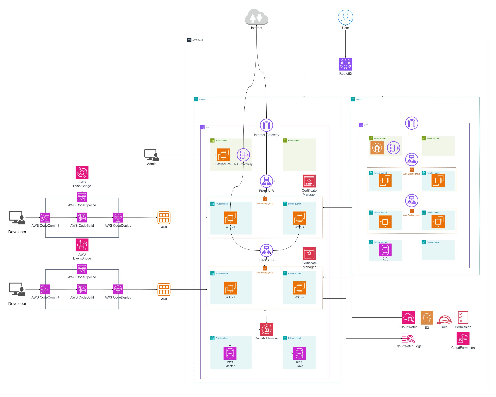

# Working SCV Project

### Architecture


- [ ] 서울리전
  - [ ] 배포와 테스트를 위한 인프라 구축 가능성.
  - [ ] ❓ On-promise에 구축할지?
  - [ ] 배포 정책과 방식에 따라 달라 질 수 있을 것
- [ ] 일본리전

### 실행
- .tfvars 파일 만들어 참조해야 함.
```sh
terraform init
terraform validate
terraform plan

terraform apply -var-file={{ YOUR_ENV_FILE_NAME }}.tfvars -auto-approve

terraform destroy -var-file={{ YOUR_ENV_FILE_NAME }}.tfvars
```

### ✅ 1. Infra
---
- [x] Infra


  - [x] vpc 생성 


  - [x] Internet Gateway 생성


  - [x] 퍼블릭 서브넷 생성
    - [x] 라우팅 테이블 생성


  - [x] webserver-was 프라이빗 서브넷 생성
    - [x] 라우팅 테이블 생성


  - [x] db 프라이빗 서브넷 생성
    - [x] 라우팅 테이블 생성


  - [x] NAT Gateway 생성
    - [x] EIP 생성

### 2. Servers
---
- [ ] Servers


  - [ ] OpenVPN
    - [x] 보안 그룹
    - [x] 구독관련된 내용이라 일단 BastionHost로 진행
    - [ ] ❓ 추후 openVPN 구축 가능성

  - [ ] Web Server
    - [x] 보안 그룹
    - [x] ALB
        - [x] 보안그룹
        - [x] SSL
        - [ ] Autoscaling
            - [ ] Templete
              - [ ] 프론트앤드 앱
            - [ ] policy
              - [ ] Scale In
              - [ ] Scale Out

  - [ ] WAS
    - [x] 보안 그룹 
    - [x] ALB
        - [x] 보안그룹
        - [x] SSL
        - [ ] Autoscaling
            - [ ] Templete
              - [ ] 앱
                - [ ] DB 연결
            - [ ] policy
              - [ ] Scale In
              - [ ] Scale Out

  - [ ] DB
    - [x] 보안 그룹
      - [ ] 퍼블릭 공개가 되어있는지 확인했는가?
      - [ ] database subnet에 배포되어있는지 확인
    - [x] SSL 인증서
      - [x] ❗️ 기본 인증서로 구성 된 후 인증서를 갱신하므로 시간이 오래 걸림. 23/12/13 17:36 확인
    - [ ] Secret manager를 활용한 자격증명 보안
      - [ ] Secret manager로 키 생성
    - [ ] was와의 연결 확인
      - [x] cli 연결
      - [x] was와의 연결
    - [ ] 정책 및 세팅 설정
      - [ ] Master-slave 구현

### 3. Services
---
- [ ] Service

  - [ ] Route53
    - [x] 인증서
      - [x] 생성
      - [x] 도메인 검증
    - [x] 레코드 등록
      - [ ] ❓ openVPN..?
      - [x] WebServer
      - [x] WAS
    - [ ] 장애조치 라우팅
    - [ ] 지역기반 라우팅

  - [ ] Global Accelator

  - [ ] S3

  - [ ] CoudFront

  - [ ] Code 시리즈
    - [ ] Code pipeline
    - [ ] Code Commit
    - [ ] Code build
    - [ ] Code deploy
    - [ ] Cloud watch
    - [ ] Event Bridge

  - [ ] Secret Manager
    - [ ] DB와 접속할 키 생성
    - [ ] EC2 인스턴스의 접근
      - [ ] IAM Role 생성
      - [ ] 정책 생성
      - [ ] 해당 인스턴스에 적용

### 4. dev
```sh
# 개발 소스 위치
cd ./workingscv
```
---
- [x] frontend
  - [ ] 웹서버 설정하기 
  - [x] 은우가 하기로 함
    - [ ] ❓ CloudFront 사용 가능성
    - [ ] ❓ S3 사용 가능성

- [ ] backend
  - [ ] 실행
    - [x] DB_HOST를 환경변수로 설정하고 실행
      - [x] ex. MY_ENV_VAR=value ./my-binary
    - [x] 실행시 필요한 더미데이터 추가
  - [ ] db 
    - [x] 스키마
      - [x] 자동 생성 만들기
      - [x] 디비 통신 확인
      - [x] 쿼리 작동 확인
    - [ ] RDS와 연결하기
      - [x] ❌ 로컬 사설 db로 연결
      - [x] ❌ RDS 공개 액세스로 연결
      - [ ] ❌ private subnet에서 연결
        - [x] ❌ cli 연결
        - [ ] 앱 연결
          - [x] id/password로 연결
          - [ ] secret manager 연결
  - [ ] 빌드 및 배포
    - [x] 바이너리 생성
      - [x] 간편한 빌드를 위해 build.sh 추가
      - [x] 운영체제별 빌드
      - [x] 아키택쳐별 빌드
    - [ ] 배포
      - [ ] autoscaling 템플릿에서 다운 받아 사용 할 수 있는 방안
        - [ ] 호스팅 사이트 업로드
        - [ ] 다운로드
  - [x] ⭕️ api
    - [x] Create
    - [x] Update
    - [x] Delete
    - [x] Get